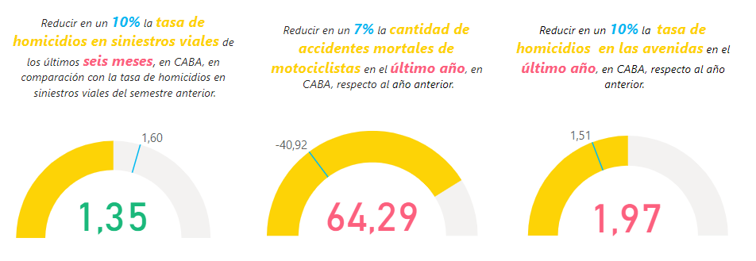

# Homicidios por siniestros viales en la Ciudad Autónoma de Buenos Aires, Argentina

## Introducción

En este proyecto se simula el rol de un Data Analyst que forma parte del equipo de analistas de datos de una empresa consultora a la cual el **Observatorio de Movilidad y Seguridad Vial (OMSV)**, que es un centro de estudios que se encuentra bajo la órbita de la Secretaría de Transporte del Gobierno de la Ciudad Autónoma de Buenos Aires (CABA), les solicitó la elaboración de un proyecto de análisis de datos. 

El fin de este proyecto es generar información que le permita a las autoridades locales tomar medidas para disminuir la cantidad de víctimas fatales de los siniestros viales ocurridos en CABA. Para ello, se pone a disposición un dataset sobre homicidios en siniestros viales acaecidos en la Ciudad de Buenos Aires durante el periodo 2016-2021.

Se espera como productos finales un reporte de las tareas realizadas, metodologías adoptadas y principales conclusiones y la presentación de un dashboard interactivo que facilite la interpretación de la información y si análisis.

## Contexto

Los siniestros viales, también conocidos como accidentes de tráfico o accidentes de tránsito, son eventos que involucran vehículos en las vías públicas y que pueden tener diversas causas, como colisiones entre automóviles, motocicletas, bicicletas o peatones, atropellos, choques con objetos fijos o caídas de vehículos. Estos incidentes pueden tener consecuencias que van desde daños materiales hasta lesiones graves o fatales para los involucrados.

La Ciudad Autónoma de Buenos Aires, que se ubica en la provincia de Buenos Aires en Argentina, no es la excepción a esta problemática, sino que los siniestros viales son una preocupación importante debido al alto volumen de tráfico y la densidad poblacional. Estos incidentes pueden tener un impacto significativo en la seguridad de los residentes y visitantes de la ciudad, así como en la infraestructura vial y los servicios de emergencia.

Actualmente, según el censo poblacional realizado en el año 2022, la población de CABA es de 3,120,612 de habitantes en una superficie de 200 $km^2$, lo que implica una densidad de aproximadamente 15,603 $hab/km^2$ ([Fuente](https://www.argentina.gob.ar/caba#:~:text=Poblaci%C3%B3n%3A%203.120.612%20habitantes%20(Censo%202022).)). Sumado a esto, el Julio de 2023 se registraron 12,437,735 de vehículos transitando por los peajes de las autopistas de acceso a CABA ([Fuente](https://www.estadisticaciudad.gob.ar/eyc/?p=41995)). Por lo que la prevención de siniestros viales y la implementación de políticas efectivas son esenciales para abordar este problema de manera adecuada.

## Datos

Para este proyecto se trabajó con la **Bases de Víctimas Fatales en Siniestros Viales** que se encuentra en formato de Excel y contiene dos pestañas de datos:

* **HECHOS**: que contiene una fila de hecho con id único y las variables temporales, espaciales y participantes asociadas al mismo.
* **VICTIMAS**: contiene una fila por cada víctima de los hechos y las variables edad, sexo y modo de desplazamiento asociadas a cada víctima. Se vincula a los HECHOS mediante el id del hecho.

En este [documento](datos\NOTAS_HOMICIDIOS_SINIESTRO_VIAL.pdf) se detallan todas las definiciones manejadas en los datos y en el desarrollo de este proyecto. Por otra parte, en este [link](https://data.buenosaires.gob.ar/dataset/victimas-siniestros-viales) se encuentran los datos utilizados en el análisis.

## Tecnologías utilizadas

Para la elaboración de este proyecto se utilizó Python y Pandas para los procesos de extracción, transformación y carga de los datos, como así también para el análisis exploratorio de los datos. En el siguiente apartado se describen los resultados del análisis.

Luego, para la obtención complementaria de datos para el cálculo de la población en el año 2021 se realizó webscraping utilizando la librería BeautifulSoup. Todos los detalles se explican [aquí](Jupyter_Notebooks\02_Datos_poblacion_CABA.ipynb).

Finalmente, para la construcción de un dashboard interactivo se utiliza Power BI, el cuál se puede consultar [aquí](PI2_homicidios.pbix). 

## Análisis Exploratorio de los Datos

En primer lugar, se realizó un proceso de extracción, transformación y carga de los datos, tanto de "HECHOS" como "VÍCTIMAS", donde se estandarizaron nombres de las variables, se analizaron nulos y duplicados de los registros, se eliminaron columnas redundantes o con muchos valores faltantes, entre otras tareas. Una vez finalizado este proceso para los dos conjuntos de datos de "Homicidios" se procedió a unir los dos conjuntos en uno solo denominado `df_homicidios`.

En segundo lugar, se procedió a realizar un análisis exploratorio exahustivo, con la finalidad de encontrar patrones que permitan generar información que le permita a las autoridades locales tomar medidas para disminuir la cantidad de víctimas fatales de los siniestros viales. Todos los detalles de este análisis se encuentran [aquí](Jupyter_Notebooks/01_EDA_homicidios.ipynb).

El análisis inicia explorando la variable temporal, para entender la distribución de los homicidios en distintas escalas temporales. De allí que se observa que no hay un patrón marcado si se observa la cantidad de víctimas para cada uno de los años. Aunque sí se observó como destacado, la disminución de la cantidad de víctimas en el año 2020 como producto de las medidas preventivas de cuarentena por la pandemia de COVID19, donde hay un "achatamiento" de la curva de víctima a niveles bajos en comparación con los otros años, desde Enero a Noviembre, con un gran aumento en Diciembre de 2020. En cambio, haciendo este mismo análisis acumulando la cantidad de víctimas para todos los años, se observa que para todo el conjunto de datos el pico de víctimas se da en el mes de Diciembre.

Si se observa la distribución semanal de las víctimas, se puede apreciar un leve aumento entre el viernes a lunes, pero se debe desatacar que no se presenta como un pico pronunciado y se considera como casi constante a lo largo de la semana. Cuando se comparan la cantidad de víctimas entre los días de semana (de lunes a viernes) y los fines de semana (sábado y domingo), se observa que la cantidad de víctimas durante la semana representan el 70% del total de víctimas.

Si por otra parte, se analiza la distribución horaria, se aprecia un pico alrededor de las 7 de la mañana, que se acompaña de un período entre las 5 a las 7 de la mañana con mayor cantidad de víctimas. Sin embargo, los valores altos se mantienen durante el horario de la mañana, hasta las 12 del mediodía, donde hay una disminución importante en la cantidad de víctimas. Posteriormente se aprecian dos picos menores al anterior, alrededor de las 18 y las 22 horas.

En relación a la edad de las víctimas, se pudo apreciar que el 75% de los accidentados son menores de 55 años, con una mediana de 39 años. Esta distribución se mantiene en general entre los distintos años analizados. Cuando se incluye el sexo de la víctima en el análisis de la edad, se aprecia que hasta el año 2020 había una tendencia creciente en las edades de las mujeres fallecidas que en hombres, con edades entre los 40 y 50 años, disminuyendo para 2021, en cambio, en los hombres, se observa una tendencia al aumento de la edad de fallecimientos pero mucho menor alrededor de los 40 años de edad.

Por otra parte, si se analiza la edad de las víctimas en función de la condición o rol al momento del hecho, se puede ver que para los roles de conductor y acompañante las edades promedio son similares, alrededor de los 35 años de edad. En el rol de Peatón es donde se observa la mayor dispersión de las edades de las víctimas, desde niños muy pequeños a adultos mayores de 95 años.

Finalmente, si se analiza la edad en función del tipo de transporte que utilizaba al momento del hecho, se aprecia que las víctimas que viajaban en moto son mayormente menores de 40 años de edad, aumentando el rango de edad si el vehículo era auto o si era peatón o pasajero de algún transporte público.

En relación con la cantidad de víctimas según el sexo de la misma, se observa el 77% de víctimas son masculinas. Se analiza la distribución del sexo en función del rol que ocupaban al momento del hecho, se observa que en relación al rol que ocupaban las víctimas, el 48% de las mismas eran conductores y de ellos el 93% eran los conductores eran masculinos. Finalmente, en cuanto al vehículo en que se trasladaban, las motos acumulan el 42% de cantidad de víctimas, siendo el 88% de sexo masculino las víctimas.

Si se analiza el hecho en concreto, se encuentra que el 15% de hechos ocurren donde se involucran peatones con pasajeros. Esto se interpreta como una persona que subía, bajaba o se trasladaba por algún medio de transporte público. Les siguen en cantidad de víctimas, la participación de motos con auto con el 12%, moto con cargas y peatón con auto con el 11% ambos.

Los acusados son en este conjunto de datos los responsables del hecho. En este sentido, el 29% de los hechos tiene como acusados responsables de conducir los autos, seguidos con un 25% de pasajeros (que se interpretan como los transportes públicos) y 21% los responsables de conducir cargas (que se refiere a los vehículos de transporte de carga).

Finalmente, si se analizan donde ocurren los hechos, se observa que el 75% de las víctimas pierden la vida en los cruces entre calles, y que las avenidas tienden a ser el lugar con mayor ocurrencia de accidentes, con el 62% de las muertes.

## KPI

En función de lo analizado en el punto anterior, se plantearon tres objetivos en relación a la disminución de la cantidad de víctimas fatales de los siniestros viales, desde los cuales se proponen tres indicadores de rendimiento clave o KPI.

* *Reducir en un 10% la tasa de homicidios en siniestros viales de los últimos seis meses, en CABA, en comparación con la tasa de homicidios en siniestros viales del semestre anterior*

    Las tasas de mortalidad relacionadas con siniestros viales suelen ser un indicador crítico de la seguridad vial en una región. Se define como **Tasa de homicidios en siniestros viales** al número de víctimas fatales en accidentes de tránsito por cada 100,000 habitantes en un área geográfica durante un período de tiempo específico, en este caso se toman 6 meses. Su fórmula es:

    $\text{Tasa de homicidios en siniestros viales} = \frac{\text{Número de homicidios en siniestros viales}}{\text{Población total}}·100,000$

    Como *Población Total* se calculó la población para el año 2021 a partir de los censos poblacionales del año 2010 y 2022.

    En este caso, para el año 2021, la *Tasa de homicidios en siniestros viales* fue de 1.77 lo que significa que, durante los primeros 6 meses del año 2021, hubo aproximadamente 1.77 homicidios en accidentes de tránsito por cada 100,000 habitantes. Ahora, el objetivo planteado es reducir esta tasa para el siguiente semestre de 2021 en un 10%, esto es **1.60**. Cuando se calcula el KPI para este período se obtiene que la *Tasa de homicidios en siniestros viales* fue de **1.35**, lo que significa que para el segundo semestre de 2021 se cumple con el objetivo propuesto.

* *Reducir en un 7% la cantidad de accidentes mortales de motociclistas en el último año, en CABA, respecto al año anterior*

    Como se vio en el análisis exploratorio, el 42% de las víctimas mortales se transportaban en moto al momento del hecho. Por lo que se consideró importante proponer el monitoreo de la cantidad de accidentes mortales en este tipo de conductor. Para ello se define a la **Cantidad de accidentes mortales de motociclistas** como el número absoluto de accidentes fatales en los que estuvieron involucradas víctimas que viajaban en moto en un determinado periodo temporal. La fórmula para medir la evolución de los accidentes mortales con víctimas en moto es:

    $\text{Cantidad de accidentes mortales de motociclistas} = -\frac{\text{Número de accidentes mortales con víctimas en moto en el año anterior - Número de accidentes mortales con víctimas en moto en el año actual}}{\text{Número de accidentes mortales con víctimas en moto en el año anterior}}·100$

    Para este caso, se toma como año actual al año 2021 y como año anterior al año 2020. En primer lugar, se calculó la *Cantidad de accidentes mortales de motociclistas* para el año 2020, el cual resultó de -44.00, de esta manera el objetivo a cumplir es de **-40.92** (es decir, la reducción del 7% de la cantidad de accidentes para 2020). El calcular la *Cantidad de accidentes mortales de motociclistas* para el año 2021 resultó de **64.29** lo que significa que aumentó un 64% la cantidad de muertes de conductores de motociclistas respecto del 2021.

* *Reducir en un 10% la tasa de homicidios en las avenidas en el último año, en CABA, respecto al año anterior*

    Como se vio en el análisis exploratorio, el 62% de las víctimas mortales transitaban por avenidas al momento del hecho. Se define a la **Tasa de homicidios en las avenidas** al número de víctimas fatales en accidentes de tránsito en avenidas por cada 100,000 habitantes en un área geográfica durante un período de tiempo específico, en este caso anual. Su fórmula es:

    $\text{Tasa de homicidios en las avenidas} = \frac{\text{Número de accidentes mortales con víctimas ocurridas en avenidas}}{\text{Total de la población}}·100000$

    En primer lugar se calculó la *Tasa de homicidios en las avenidas* para el año 2020, la cual resultó en 1.68. De esta se pudo determinar el objetivo a cumplir al año siguiente, que resultó en **1.51** (es decir, la reducción del 10% de la tasa de homicios respecto del 2020). Finalmente, al calcular la *Tasa de homicidios en las avenidas* para el año 2021, la misma resultó de 1.97, lo que significa que se superó el objetivo, aumentando la tasa de mocidios en avenidas respecto al año anterior.

En la siguiente imagen se aprecian los rendimientos de los tres KPI propuestos.

## Conclusiones y recomendaciones

Entre los años 2016 a 2019 se registraron 717 víctimas fatales en accidentes de tránsito. El 70% de las víctimas se registraron durante la semana. En cuanto a la franja horaria, el 12% de los hechos ocurre entre las 6 y las 8 de la mañana, pero durante los fines de semana. Diciembre es el mes que resulta con el máximo de fallecimientos en el período analizado.

El 77% de las víctimas fatales fueron de sexo masculino, de los cuales casi el 50% tenía entre 25 y 44 años de edad. En relación al tipo de usuario, el 42% fueron motociclistas. El 62% de los homicidios ocurrió en algún punto de las avenidas de CABA, siendo el 82% de ellos en un cruce de la autopista con alguna otra calle. En ese sentido, el 75% de los hechos ocurrieron en cruces de calles.

Finalmente, para el segundo semestre del año 2021, se cumplió con el objetivo de bajar la tasa de homicidios en siniestros viales, pero no se cumplieron los objetivos de reducir la cantidad de accidentes mortales en motociclistas ni en avenidas para el año 2021 respecto del año 2020.

En función de lo anterior, se hacen las siguientes recomendaciones:

* Continuar monitoreando los objetivos propuestos acompañados de campañas puntuales, en especial a conductores de motos y usuarios de las avenidas.
* Reforzar las campañas de seguridad vial entre los días viernes a lunes, intensificando particularmente en el mes de Diciembre.
* Puntualizar campañas de conducción segura en avenidas y cruces de calles.
* Dirigir las campañas de seguridad hacia el sexo masculino, especialmente en cuanto a conducción en moto, para un rango etario entre los 15 a 44 años.